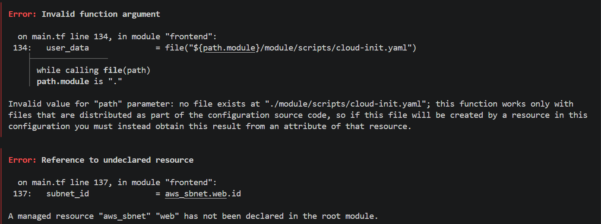

# 4640-make-up-terraform

Starter code for make up lab, 4640.

See D2L for instructions.

## for error 1-4:
modify the typo:

route_tble_id -> route_table_id

subnt_id -> subnet_id

from_prt -> from_port

## error 5
correct the wrong path:

file("${path.module}/module/scripts/cloud-init.yaml") -> 
file("${path.module}/scripts/cloud-init.yaml")

## error 6
correct the typo:

aws_sbnet.web.id -> aws_subnet.web.id
